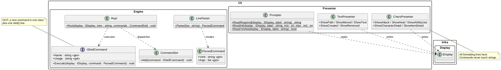
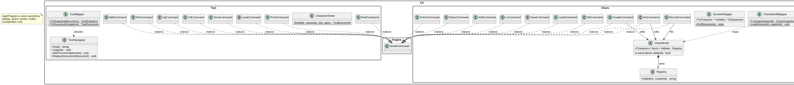
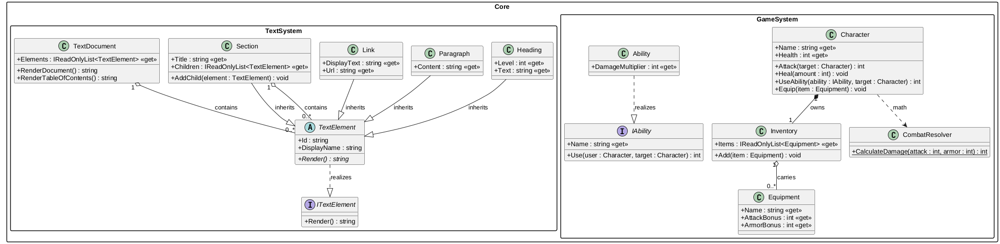
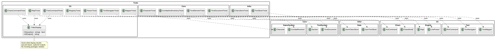

# Layers - шари CLI / Core / Infra


Навчальний проєкт: той самий командний інтерфейс для персонажів і тексту,
перекладений на шарувату структуру CLI / Core / Infra. Кожен шар - окремий
проєкт зі своїми моделями, залежності тільки вниз, частини замінні:
дисплей, формат сейвів і презентери міняються без торкання команд і домену.

## Зміст

- [Можливості](#можливості)
- [Технології](#технології)
- [Структура](#структура)
- [Швидкий старт](#швидкий-старт)
- [Тестування](#тестування)
- [Сумісність з версіями .NET](#сумісність-з-версіями-net)
- [Діаграма класів](#діаграма-класів)
- [Ролі класів](#ролі-класів)
- [Як замінити частину](#як-замінити-частину)
- [Автор](#автор)
- [Ліцензія](#ліцензія)

## Можливості

Все з попереднього шелла (режими `--text` / `--chars`, діалог, 10 команд,
id і імена, сувора перевірка аргументів) плюс нове по шарах:

* **Presenter** - весь вивід і діалоги винесено з команд: `CharsPresenter`,
  `TextPresenter`, `Prompter`. Команди вирішують що, презентер - як.
* **Display (Infra)** - консоль за інтерфейсом `IDisplay`; заміна -
  один клас.
* **Data (Infra)** - стан обох світів серіалізується в JSON
  (`save <file>` / `load <file>` в кожному режимі): персонажі з HP,
  спорядженням і книгами; документ деревом з id. Формат міняється
  реалізацією `ICharsStore` / `ITextStore`.
* **Core без змін API** - для відновлення стану лише `internal RestoreState`
  і `InternalsVisibleTo("Cli")`; публічна поверхня та сама.

## Технології

| Технологія | Версія / примітка |
|---|---|
| C# | 12 |
| .NET (таргет) | 8.0 (`net8.0`, `RollForward LatestMajor`) |
| .NET SDK для збірки | 8 або новіший |
| JSON | `System.Text.Json` для сейвів |
| xUnit | 112 тести: `Tests.Core` (39), `Tests.Infra` (7), `Tests.Cli` (66) |
| PlantUML | діаграма класів (`docs/`) |
| CI | GitHub Actions (Ubuntu + Windows): збірка, тести, прогін 4 демо |

## Структура

```
Layers.sln / Layers.slnx
src/Core/      - домен: GameSystem (Character, Equipment, Inventory,
                 Ability, CombatResolver), TextSystem (TextElement, Section,
                 Heading, Paragraph, Link, TextDocument)
src/Infra/     - Display (IDisplay, ConsoleDisplay), Data (DTO, ICharsStore /
                 ITextStore, JsonCharsStore / JsonTextStore)
src/Cli/       - Engine (парсер, команди, REPL), Presenter (Prompter,
                 CharsPresenter, TextPresenter), Chars (Registry, CharsWorld,
                 маппер, команди), Text (TextNavigator, TextSeed, маппер,
                 команди)
src/App/       - Program.cs: композиційний корінь, вибір режиму
src/Tests.Core/  - 39 тестів домену: бій, інвентар, елементи, документ
src/Tests.Infra/ - 7 тестів сховищ: раундтріп JSON і помилки файлів
src/Tests.Cli/   - 66 тестів: парсер, реєстри, команди через FakeDisplay,
                   навігація, маппери, REPL
demo/          - chars-demo, text-demo, save-chars, save-text
docs/          - діаграма класів (.puml + .png) і звіт (.docx)
```

Залежності проєктів тільки вниз: App -> Cli -> {Core, Infra}, Infra -> Core.

## Швидкий старт

Потрібен [.NET 8 SDK](https://dotnet.microsoft.com/download) або новіший.

```bash
dotnet build Layers.sln
dotnet run --project src/App -- --chars
dotnet run --project src/App -- --text
```

Демо-прогони (так перевіряє CI):

```bash
dotnet run --project src/App --no-build -- --chars < demo/chars-demo.txt
dotnet run --project src/App --no-build -- --text < demo/text-demo.txt
dotnet run --project src/App --no-build -- --chars < demo/save-chars.txt
dotnet run --project src/App --no-build -- --text < demo/save-text.txt
```

Сейви пишуться JSON поруч (`demo/saves/`, ігноряться гітом):

```
> save demo/saves/chars.json
Saved to 'demo/saves/chars.json'.
> load demo/saves/chars.json
Loaded from 'demo/saves/chars.json': 1 characters, 1 items, 1 abilities.
```

## Тестування

```bash
dotnet test Layers.sln
```

Три тестові проєкти йдуть за шарами: `Tests.Core` перевіряє доменну
логіку (бій, інвентар, рендер, зміст), `Tests.Infra` - JSON-сховища на
тимчасових файлах (раундтріп і помилки), `Tests.Cli` - парсер, реєстри,
навігацію, маппери і команди. Замість моків - ручний `FakeDisplay`:
черга вводу і захоплений вивід без зайвих залежностей. CI ганяє тести
на Ubuntu і Windows при кожному пуші.

## Сумісність з версіями .NET

* Збірка: .NET 8 SDK або новіший (класичний `Layers.sln` читають усі).
* Запуск: рантайм .NET 8, 9 або 10 через `RollForward LatestMajor`.
* Рантайми старіші за 8.0 не підійдуть.

## Діаграма класів

Система показана чотирма фігурами: ядро інтерпретатора, режими зі
сховищами, домени Core, тести.









Повний звіт з ролями класів: `docs/Layers_Report.docx`.

## Ролі класів

| Клас | Роль |
|---|---|
| `IDisplay` / `ConsoleDisplay` | Infra: консоль за абстракцією, замінна реалізація |
| `ICharsStore` / `JsonCharsStore`, `ITextStore` / `JsonTextStore` | Infra: сейви, формат замінний, домену не знають (лише DTO) |
| `IShellCommand` / `CommandSet` / `Repl` / `LineParser` | Engine: контракт команд, реєстр, цикл, парсер |
| `CharsPresenter` / `TextPresenter` / `Prompter` | Presenter: весь вивід і діалоги, команди чисті від форматування |
| `Registry` / `CharsWorld` | Моделі режиму: id, пошук, книги здібностей |
| `TextNavigator` | Модель режиму: позиція, шляхи, нумерація |
| `CharsWorldMapper` / `TextMapper` | Міст світ-DTO, відновлення через internal API Core |
| `Character` / `Ability` / `Section` / `TextDocument` | Core: домен без змін публічного API |

## Як замінити частину

* Інший вивід: реалізувати `IDisplay` і передати в `Program.cs` замість
  `ConsoleDisplay` - команди і презентери не чіпати.
* Інший формат сейвів: реалізувати `ICharsStore` / `ITextStore` і
  підмінити `JsonCharsStore` / `JsonTextStore` в `Program.cs`.
* Нова команда: клас з `IShellCommand` + один `Add()` у фабриці режиму.
* Новий режим: світ + презентер + фабрика + гілка в `Program.cs`.

## Автор

Воскобойников Марк, КН-31

## Ліцензія

MIT - див. [LICENSE](LICENSE).
